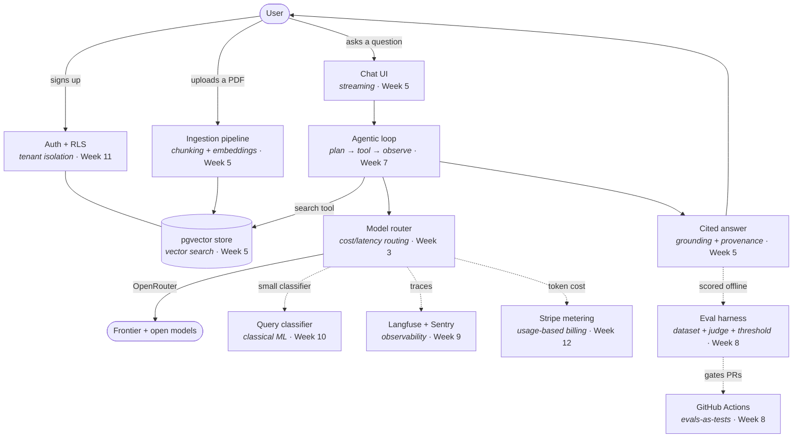

# Concept map — what you learn, and where it lands in Scholar

Every AI concept in this course is taught by building a specific part of **Scholar**, the document-grounded research assistant. This page is the map: concept on the left, the plain-English version in the middle, the actual thing you build on the right.

Read it two ways. Top to bottom, it's the learning arc. Right column first, it's a build plan.

---

## The app, with the concepts labelled

Solid arrows are the request path. Dotted arrows are the disciplines wrapped around it — the parts that separate a demo from a product.

---

## Pillar 1 — Building and deploying AI applications

### LLM foundations (Week 3)

| Concept | In plain terms | Where it lands in Scholar |
|---|---|---|
| Tokens | The chunks of text a model actually reads and bills you for — roughly ¾ of a word each | Counting tokens before a call so a request can't blow the budget |
| Context window | The model's working memory: everything it can see at once | The cap the retrieval step must fit inside |
| Context budget | A deliberate split of that window across system prompt, retrieved chunks, history, and answer | A named constant in `lib/llm/`, enforced in code, not a vibe |
| Sampling parameters | Dials (temperature, top-p) that trade off predictable vs. creative output | Low temperature for citations, higher for drafting |
| Structured output | Making the model return JSON that matches a schema instead of prose | Zod schemas on every LLM response boundary |
| Tool calling | Letting the model ask your code to run a function and hand back the result | `search`, `read_page`, `cite` — the tools Scholar's agent uses |
| Model routing | Picking a different model per task based on cost, speed, and quality | `lib/llm/router.ts`, with an env-driven fallback list |

### Grounding with data — RAG (Week 5)

| Concept | In plain terms | Where it lands in Scholar |
|---|---|---|
| Grounding | Anchoring an answer in real retrieved text so it can be traced to a source | Every Scholar answer carries inline citations |
| Chunking | Cutting documents into pieces small enough to search over | The ingestion pipeline; chunk strategy is a measurable choice |
| Embeddings | Turning text into a list of numbers so "similar meaning" becomes "close together" | Generated at upload, stored per chunk |
| Vector search | Finding the chunks closest in meaning to a question | pgvector queries on Supabase |
| Hybrid search | Combining keyword matching with vector similarity, because each fails differently | BM25 + vector, merged and reranked |
| Reranking | A second, smarter pass that reorders the first pass's results | Applied before context assembly |
| Context assembly | Deciding what actually goes into the prompt, in what order | The step between search and generation |
| RAG failure modes | The specific ways retrieval goes wrong: nothing relevant found, right chunk ranked low, contradictory sources | Each one gets a test in the eval set |

### Agentic systems (Week 7)

| Concept | In plain terms | Where it lands in Scholar |
|---|---|---|
| Agentic loop | Plan → act with a tool → look at the result → decide whether to keep going | Scholar's multi-step research workflow |
| Tool design | Writing functions an agent can actually use well: clear name, tight schema, honest errors | The tool definitions the agent is given |
| Memory & state | What the agent carries between steps, and where it's stored | Per-session research state |
| Verifier loop | Having a separate step check the output before it's accepted | Citation check: does every claim map to a retrieved chunk? |
| Loop control | Max iterations, retries, partial failure, cost ceilings | Guards that stop a runaway agent burning credit |

### Evaluation-driven development (Week 8)

| Concept | In plain terms | Where it lands in Scholar |
|---|---|---|
| Eval | A dataset, a scoring function, and a threshold — not a benchmark, not a vibe check | `lib/evals/` |
| The three eval types | Unit-style (one component), task-level (one feature), end-to-end (the whole flow) | One suite each |
| Eval dataset | Fifty real examples with known-good answers, built fast | Grown from actual Scholar queries |
| LLM-as-judge | Using a model to score another model's output against a written rubric | Scoring answer quality and citation faithfulness |
| Regression testing | Proving a prompt or model change didn't make things worse | Evals run in CI and block the PR |
| Error analysis | Reading the failures and grouping them, which is where real improvement comes from | The weekly loop once Scholar has users |

### Operating in production (Week 9)

| Concept | In plain terms | Where it lands in Scholar |
|---|---|---|
| Cost control | Token budgets, per-user quotas, caching, cheaper models where quality allows | Enforced per request, tracked per user |
| Latency engineering | Streaming, edge functions, prefetching — making it *feel* fast | Streamed answers from the first token |
| Reliability | Retries, fallbacks, circuit breakers, provider redundancy | OpenRouter fallback chain in the router |
| Observability | Traces (what the LLM did), errors (what broke), metrics (what users felt) | Langfuse + Sentry + Vercel Analytics |
| Prompt injection | User-supplied text that hijacks the model's instructions | Defenses on every path where uploaded text reaches a prompt |
| PII handling | Knowing what personal data you hold and not leaking it into logs or prompts | Redaction before tracing |

### ML foundations (Week 10)

| Concept | In plain terms | Where it lands in Scholar |
|---|---|---|
| When classical ML wins | Structured data, tight latency budgets, low cost, explainability | Replacing an LLM call in the query router with a small classifier |
| Fine-tuning | Training a small model on your own examples so it beats a big general one at one job | Costed honestly; used only where the eval harness proves it pays |
| Training vs. inference | The difference between building a model and calling one | The vocabulary to talk to ML engineers without pretending to be one |

---

## Pillar 2 — Software engineering fundamentals (Week 4, reinforced throughout)

| Concept | In plain terms | Where it lands in Scholar |
|---|---|---|
| The tradeoff table | Cost, latency, reliability, quality, privacy — you can't max all five | The decision frame for every stack choice |
| Boundary contracts | Validating data wherever it crosses a trust line | Zod on LLM output, API input, form data |
| Testing nondeterminism | Snapshot what's deterministic, evaluate what isn't | Vitest for logic, evals for model behaviour |
| Migrations | Versioned, repeatable database changes | `supabase/migrations/` from Week 2 onward |
| Background jobs | Work too slow to do inside a web request | Document ingestion via edge function |
| CI/CD | Machines running your checks on every push | Lint, typecheck, test, and evals on every PR |

## Pillar 3 — Using coding agents (Week 6)

| Concept | In plain terms | Where it lands in Scholar |
|---|---|---|
| Spec-first workflow | Writing down what you want precisely enough that an agent can build it | A `SPEC.md` before each feature |
| Context management | Choosing what the agent sees, and what it must not | Repo conventions the agent reads |
| Closing the loop | Giving the agent a way to check its own work | Your test and eval commands, handed to the agent |
| Guardrails | Hard limits that keep an agent away from production data | Env separation, scoped keys |

## Pillar 4 — Shaping the build (Weeks 13–14)

| Concept | In plain terms | Where it lands in Scholar |
|---|---|---|
| The spec is the work | For AI apps, deciding exactly what to build is most of the difficulty | The v2 spec written after user interviews |
| "Good enough to ship" | Choosing a quality bar and proving you've hit it | A threshold in the eval suite, not a feeling |
| Customer development | Talking to real people before building | Five interviews in Week 13 |
| Launch instrumentation | Measuring the things that tell you what to fix next | Feedback capture wired in Week 14 |

---

## The same map, by week

| Week | Concepts introduced | What exists in Scholar afterwards |
|---|---|---|
| 1 | The four pillars; what AI engineering is | A forked repo and a first commit |
| 2 | Environments, secrets, migrations, preview deploys | A live URL that calls a real LLM |
| 3 | Tokens, context, structured output, tool calling, routing | `lib/llm/router.ts` |
| 4 | Tradeoffs, boundary contracts, testing nondeterminism | A typed API route and a test suite |
| 5 | Grounding, chunking, embeddings, hybrid search, citations | Upload → ingest → search → cited chat |
| 6 | Spec-first work, context management, verifier discipline | A feature built with an agent, workflow documented |
| 7 | Agentic loops, tool design, memory, loop control | Multi-step research with a citation graph |
| 8 | Evals, judges, regression gates, error analysis | `lib/evals/` blocking bad PRs |
| 9 | Cost, latency, reliability, observability, injection, PII | Scholar in production, monitored, with a runbook |
| 10 | When classical ML wins; fine-tuning economics | A cheaper query router, measured |
| 11 | Auth, RLS, multi-tenancy, rate limits | Scholar is safe for many users |
| 12 | Metering, pricing, subscriptions, abuse handling | Scholar takes money |
| 13 | Specs, product sense, the ship/no-ship call | A v2 spec grounded in real interviews |
| 14 | Launch mechanics, feedback loops, staying current | Scholar is public |
