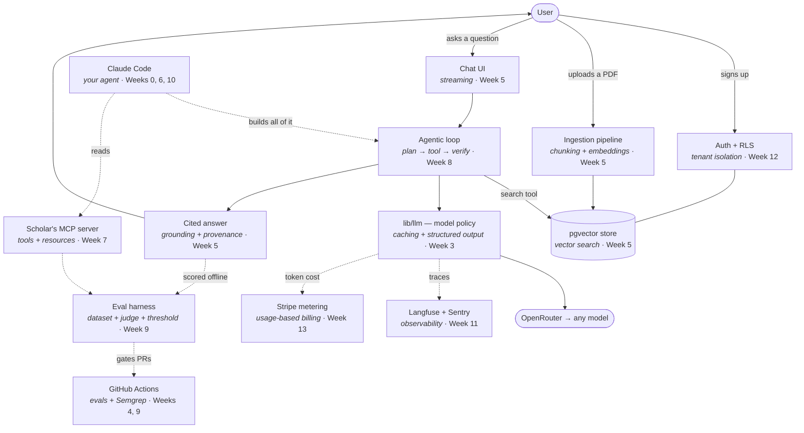

# Concept map — what you learn, and where it lands in Scholar

Every concept in this course is taught by building a specific part of **Scholar**, the document-grounded research assistant. This page is the map: concept on the left, the plain-English version in the middle, the actual thing you build on the right.

Read it two ways. Top to bottom, it's the learning arc. Right column first, it's a build plan.

---

## The app, with the concepts labelled

Solid arrows are the request path. Dotted arrows are the disciplines wrapped around it — evals, observability, metering — plus the agent that builds the whole thing and the MCP server that lets it run your evals itself.

---

## Pillar 1 — Building and deploying AI applications

### Model foundations (Week 3)

| Concept | In plain terms | Where it lands in Scholar |
|---|---|---|
| Tokens | The chunks of text a model reads and bills you for — roughly ¾ of a word each | Counted before a call so a request can't blow the budget |
| Context window | The model's working memory: everything it can see at once | The cap the retrieval step must fit inside |
| Context budget | A deliberate split of that window across system prompt, retrieved chunks, history, and answer | A named constant in `lib/llm/`, enforced in code |
| Structured output | Making the model return JSON matching a schema instead of prose | A JSON-schema `response_format`, re-validated with Zod because `strict` isn't honoured everywhere |
| Tool use | Letting the model ask your code to run a function and hand back the result | `search`, `read_document`, `cite` — the tools Scholar's agent uses |
| Reasoning & effort | Letting the model reason before answering, and dialling how hard it works | High effort for research synthesis, low for routing |
| Prompt caching | Reusing an unchanged prefix across calls so you don't pay full price twice | A frozen system prefix; volatile content ordered after it |
| Model policy | Picking a model per task on cost, speed, and quality — not once, globally | The routing table in `lib/llm/`, one string per task |

### Grounding with data — RAG (Week 5)

| Concept | In plain terms | Where it lands in Scholar |
|---|---|---|
| Grounding | Anchoring an answer in real retrieved text so it can be traced to a source | Every Scholar answer carries inline citations |
| Chunking | Cutting documents into pieces small enough to search over | The ingestion pipeline; a measurable choice |
| Embeddings | Turning text into numbers so "similar meaning" becomes "close together" | Generated at upload, stored per chunk |
| Vector search | Finding the chunks closest in meaning to a question | pgvector queries on Supabase |
| Hybrid search | Keyword matching plus vector similarity, because each fails differently | BM25 + vector, merged and reranked |
| Context assembly | Deciding what actually goes into the prompt, in what order | The step between search and generation |
| RAG failure modes | Nothing relevant found; right chunk ranked low; sources contradict | Each becomes a Week 9 eval case |

### Agentic systems (Week 8)

| Concept | In plain terms | Where it lands in Scholar |
|---|---|---|
| Agentic loop | Plan → act with a tool → look at the result → decide whether to continue | Scholar's multi-step research workflow |
| Tool design | Functions an agent can use well: clear name, tight schema, honest errors | The tool definitions the agent is given |
| Memory & compaction | What the agent carries between steps, and how you stop it filling the window | Per-session research state |
| Verifier loop | A separate step checks the output before it's accepted | Citation check: does every claim map to a retrieved chunk? |
| Loop control | Max iterations, retries, partial failure, cost ceilings | Guards that stop a runaway agent burning credit |
| Multi-agent orchestration | Splitting work across agents when one context can't hold it | A reading subagent per source, results merged |

### Evaluation-driven development (Week 9)

| Concept | In plain terms | Where it lands in Scholar |
|---|---|---|
| Eval | A dataset, a scoring function, and a threshold — not a benchmark, not a vibe check | `lib/evals/` |
| The three eval types | Unit-style, task-level, end-to-end | One suite each |
| LLM-as-judge | Using a model to score another model's output against a written rubric | Answer quality and citation faithfulness |
| Judge validation | Checking the judge agrees with humans before trusting it | A labelled subset scored both ways |
| Regression gate | Proving a prompt or model change didn't make things worse | Evals in CI, blocking the PR |
| Error analysis | Reading failures and grouping them — where improvement actually comes from | The weekly loop once Scholar has users |

### Operating in production (Week 11)

| Concept | In plain terms | Where it lands in Scholar |
|---|---|---|
| Cost control | Caching, effort, quotas, cheaper models where quality allows | Enforced per request, tracked per user |
| Latency engineering | Streaming, edge, prefetching — making it *feel* fast | Streamed answers from the first token |
| Reliability | Retries, fallbacks, circuit breakers, another model when one provider is down | The fallback chain in `lib/llm/` |
| Observability | Traces (what the model did), errors (what broke), metrics (what users felt) | Langfuse + Sentry + Vercel Analytics |
| Prompt injection | User-supplied text that hijacks the model's instructions | Defended on every path where uploaded text reaches a prompt |
| PII handling | Knowing what personal data you hold and keeping it out of logs and prompts | Redaction before tracing |
| When classical ML wins | Structured data, tight latency, low cost, explainability | A small classifier replacing a routing call — proven in the eval harness |

---

## Pillar 2 — Software engineering fundamentals (Weeks 4, 10, 12)

| Concept | In plain terms | Where it lands in Scholar |
|---|---|---|
| The tradeoff table | Cost, latency, reliability, quality, privacy — you can't max all five | The frame for every stack decision |
| Boundary contracts | Validating data wherever it crosses a trust line | Zod on model output, API input, form data |
| Testing nondeterminism | Snapshot what's deterministic, evaluate what isn't | Vitest for logic, evals for model behaviour |
| Static analysis | A scanner that finds injection, SSRF, and leaked secrets before review does | Semgrep in CI from Week 4 |
| Reviewing at agent velocity | Reading a large diff you didn't write, for intent rather than syntax | The Week 10 review exercise |
| Migrations | Versioned, repeatable database changes | `supabase/migrations/` from Week 2 |
| CI/CD | Machines running your checks on every push | Lint, typecheck, test, Semgrep, evals |

## Pillar 3 — Using coding agents (Weeks 0, 6, 7, 10)

| Concept | In plain terms | Where it lands in Scholar |
|---|---|---|
| Project context | The file that tells the agent this repo's rules | `CLAUDE.md`, written in Week 0 |
| Context engineering | Choosing what the agent sees, what it must not, and when to compact | Week 6, applied to a real feature |
| Plan mode & permissions | Read-only investigation, and how much the agent may do unasked | The guard around `.env.local` and production data |
| Subagents | Delegating a slice of work to a separate context | Parallel review and research tasks |
| Hooks | Your conventions enforced mechanically, not hopefully | A hook that blocks commits failing typecheck |
| Spec-first workflow | Writing down what you want precisely enough that an agent can build it | A `SPEC.md` before each feature |
| Defensive prompting | Assuming the model is fallible and specifying against it | Every prompt in `lib/llm/` |
| Context failure modes | Poisoning, distraction, confusion, clash — how long contexts go wrong | Named in Week 6, watched for thereafter |
| MCP | A protocol for handing tools and data to any agent, once | Scholar's own MCP server, Week 7 |
| Skills | Packaged, reusable capability an agent can load on demand | Week 7 |

## Pillar 4 — Shaping the build (Weeks 13–14)

| Concept | In plain terms | Where it lands in Scholar |
|---|---|---|
| The spec is the work | For AI apps, deciding exactly what to build is most of the difficulty | The v2 spec after user interviews |
| "Good enough to ship" | Choosing a quality bar and proving you've hit it | A threshold in the eval suite, not a feeling |
| Customer development | Talking to real people before building | Five interviews in Week 14 |
| Usage metering | Turning token cost into an invoice line | Week 13 |
| Launch instrumentation | Measuring the things that tell you what to fix next | Week 14 |

---

## The same map, by week

| Week | Concepts introduced | What exists afterwards |
|---|---|---|
| 0 | Project context, plan mode, permissions, agent cost habits | Claude Code set up, `CLAUDE.md` written |
| 1 | The four pillars; the certification domains | A forked repo and a first commit |
| 2 | Environments, secrets, migrations, preview deploys | A live URL that streams a real answer |
| 3 | Tokens, context, structured output, tool use, effort, caching | `lib/llm/` with a model policy |
| 4 | Tradeoffs, boundary contracts, testing nondeterminism, static analysis | A typed API route, a test suite, Semgrep in CI |
| 5 | Grounding, chunking, embeddings, hybrid search, citations | Upload → ingest → search → cited chat |
| 6 | Context engineering, subagents, hooks, spec-first, verifier loops | A feature built to spec, workflow documented |
| 7 | MCP, tool design, transports, skills | Scholar's MCP server, running your evals |
| 8 | Agentic loops, memory, loop control, orchestration | Multi-step research with a citation graph |
| 9 | Evals, judges, regression gates, error analysis | `lib/evals/` blocking bad PRs |
| 10 | The review hierarchy, reading for intent, AI review limits | One feature reviewed twice, written up |
| 11 | Cost, latency, reliability, observability, injection, PII, classical ML | Scholar in production, monitored, with a runbook |
| 12 | Auth, RLS, multi-tenancy, rate limits | Scholar is safe for many users |
| 13 | Metering, pricing, subscriptions, abuse handling | Scholar takes money |
| 14 | Specs, the ship/no-ship call, launch mechanics | Scholar is public |
